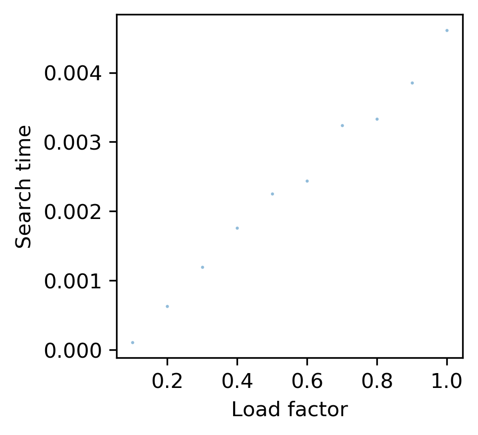
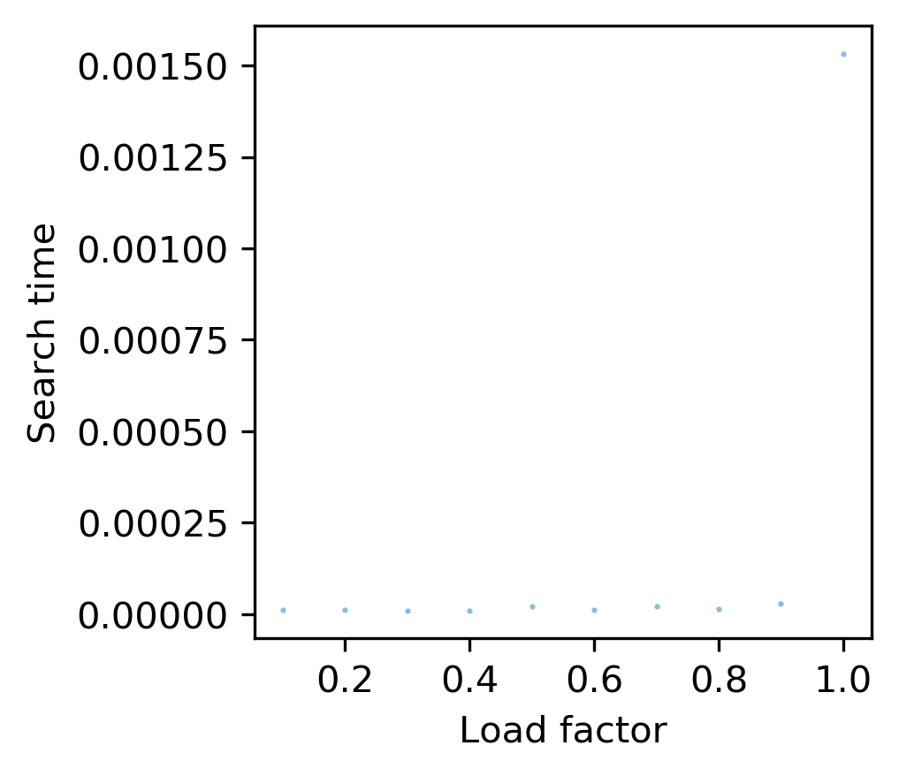

# Hash tables

## Project Description

This project compares the performance of hash tables built using different
hash functions and collision resolution strategies. Hash strategies were
benchmarked to compare both the randomness of the distribution of keys
throughout the hash function and the speed of returning values at increasing
load factor.

Hash functions evaluated:

1. h_ascii: A basic hash function using the ASCII values of characters. Takes
a string key and a hash table size and returns a hash that is based on the sum
of the ASCII values for the characters in the key.

2. h_rolling: A hash function using the polynomial rolling hash algorithm. The
ASCII value for each character in the string key is multiplied by p^i, where p
is a prime number and i is the string index; this output is summed and divided
by a large number m. The default arguments for this function are p=53 and
m=2^64.

3. h_python: The default hash function built into python.

Collision methonds evaluated:

1. Linear probing: For a hash table with N slots, keys are added by starting at
the slot determined by the hash function. If the slot is empty add the key,
otherwise continue linearly through the hash table until an empty slot is found
or the table is determined to be full. Use the same method for searching for
keys.

2. Chained hash: For a hash table with N slots, each slot contains an empty list
to append keys. Use the hash function to determine which slot, then search
linearly through the list.

## How to test methods

Code to test the hash methods is written in the benchmark.sh bash script. To run
the test script, save it in a directory along with the following files:
1. mean.py
2. non_rand_words.txt
3. rand_words.txt
4. scatter.py
5. hash_functions.py
6. hash_tables.py

Additional files in this repository are:
1. test_hash_tables.py
2. test_hash_functions.py
3. README.md
4. .travis.yml

To run the benchmarking script, run `$ bash benchmark.sh`  at the command line.

Below are plots showing the distribution of hash values from each of the
3 hash functions, for non-random and random input keys.

## h_ascii non-random

## h_ascii random

## h_rolling non-random

## h_rolling random

## h_python non-random

## h_python random

Each function performs better with random keys than highly similar keys,
particularly the ascii and rolling functions. This makes sense because both
functions sum up values based on the letters in the input key. The built-in
python function produced the most even distribution of hash values.

The next goal was to test the time it takes to add and retrieve keys and values
from hash tables using different collision resolution strategies. Below are
plots of the add and search times for the linear probing and chained hash methods,
using both the ascii and rolling hash functions.

## h_ascii linear probing time to add

## h_ascii linear probing time to search

## h_ascii chained hash time to add

## h_ascii chained hash time to search

## h_rolling linear probing time to add

## h_rolling linear probing time to search

## h_rolling chained hash time to add

## h_rolling chained hash time to search

The more evenly distributed rolling function is faster to add and search from
than the ascii function, while chained hash is faster than linear probing.

## How to install project

Before installation:
    - wget https://repo.anaconda.com/miniconda/Miniconda3-latest-Linux-x86_64.sh
    - bash Miniconda3-latest-Linux-x86_64.sh -b
    - . /home/travis/miniconda3/etc/profile.d/conda.sh
    - conda config --add channels r
    - conda create --yes -n test
    - conda activate test
    - conda install --yes python=3.6
    - conda install -y pycodestyle

Access software on [GitHub]
(https://github.com/cu-swe4s-fall-2019/hash-tables-alisoncleonard)
